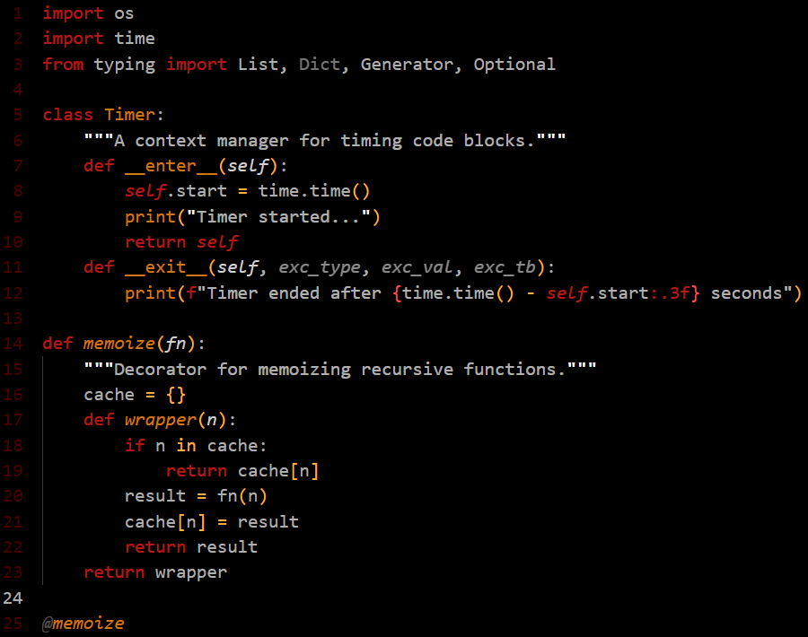
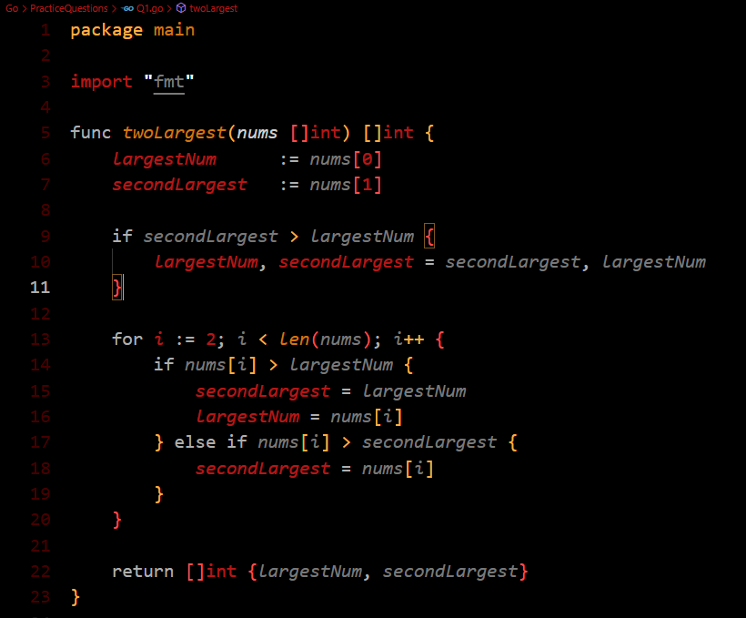
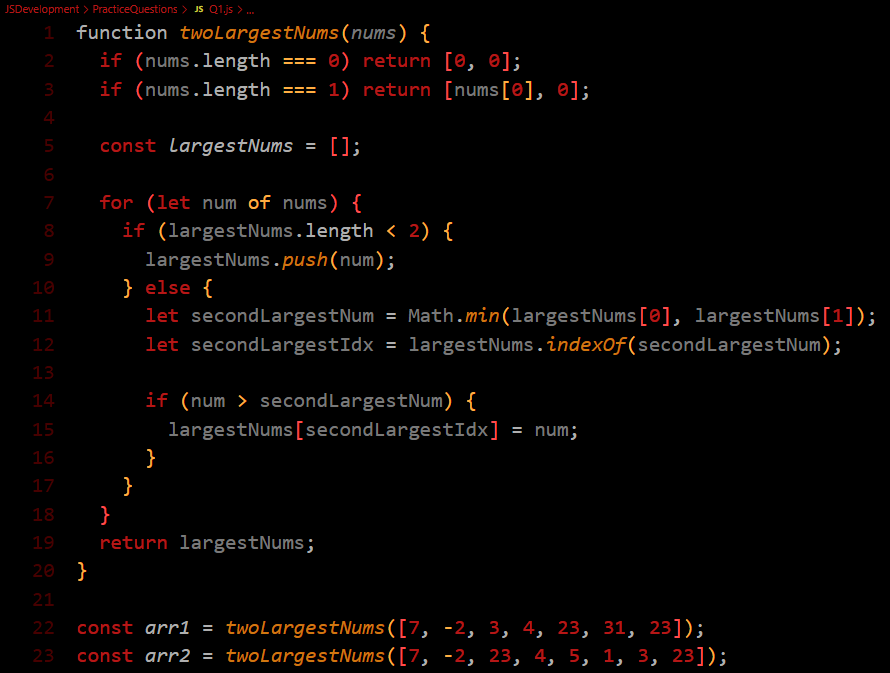

# Sunset Burst!

This is a high-contrast red, orange, black and grey theme.
Almost all elements are custom color coded for Python, Go,
and JavaScript. I'll add more customizations for more
languages in the future.

## How to Use
To activate the sunset burst theme, follow these steps:

    1. Launch Visual Studio Code.
    2. Open the Command Palette by pressing `Ctrl+Shift+P`.
    3. Type "Preferences: Color Theme" and select it from the list.
    4. In the color theme selection menu, choose "Sunset Burst".

# Language Screenshots

Python

Go

JavaScript

If you come across any issues or have suggestions for
improvement, feel free to make a pull request to the 
[GitHub Repository](https://github.com/Ecliperr/sunset-burst.git)

**Enjoy Sunset Burst!**
